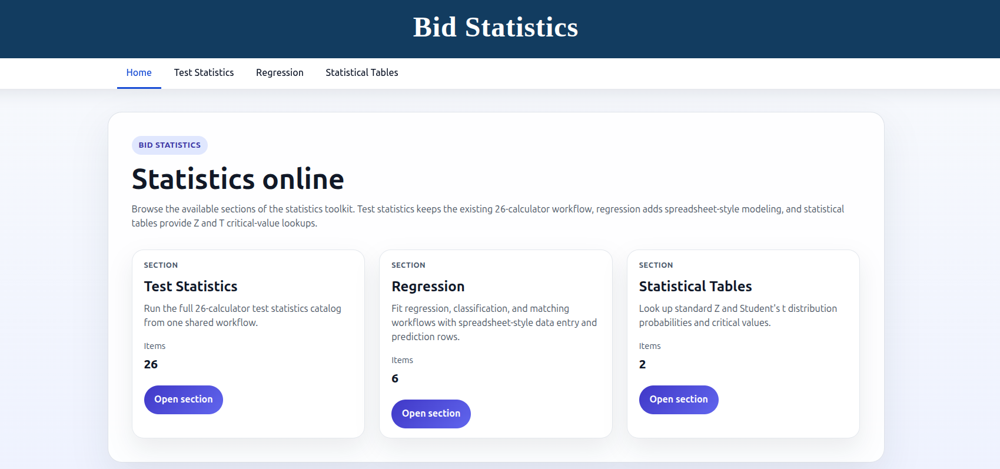
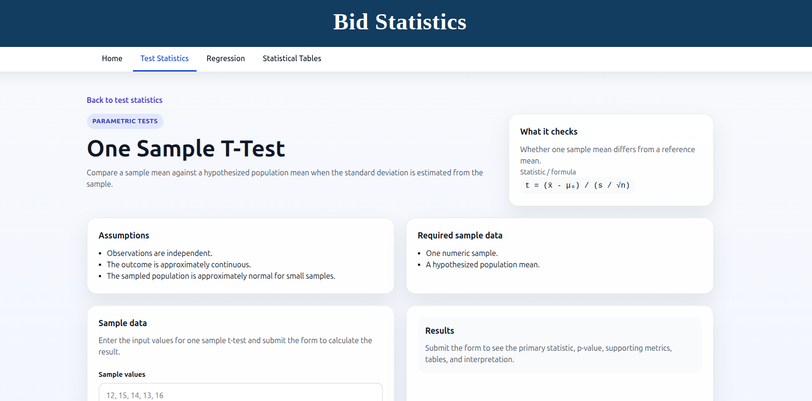
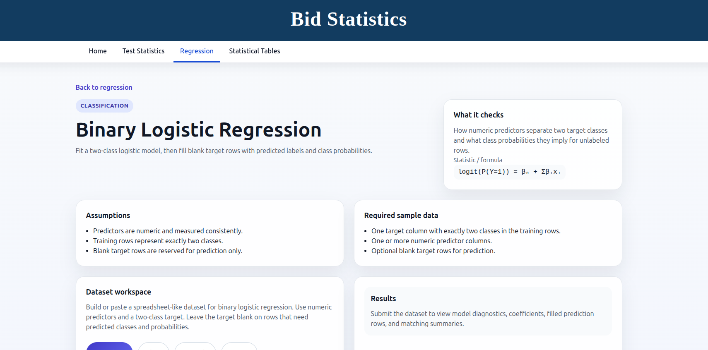
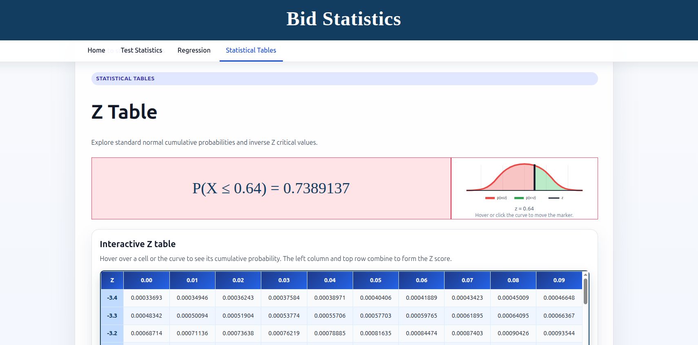

# Bid Statistics

Bid Statistics is a Django + Inertia + React web application for running statistical workflows in the browser. It combines classic hypothesis-test calculators, spreadsheet-style regression tools, and interactive statistical reference tables behind one shared navigation system.

The project is organized around three user-facing sections:

1. **Test Statistics** — a 26-calculator catalog for hypothesis tests and related statistical procedures.
2. **Regression** — spreadsheet-style regression, classification, prediction, and propensity-score matching workflows.
3. **Statistical Tables** — interactive Z and T reference tables with distribution previews.

---

## Screenshots

### Home page



### Test Statistics catalog and calculator workflow



### Regression spreadsheet workflow



### Statistical Tables section



---

## Feature overview

### 1. Test Statistics

The **Test Statistics** section exposes a metadata-driven catalog of 26 calculators. Each calculator defines its own metadata, input schema, validation rules, result formatting, and interpretation text.

Supported families include:

- Parametric tests
- Nonparametric tests
- ANOVA and repeated-measures workflows
- Multivariate analysis
- Proportion tests
- Variance tests
- Distribution tests
- Survival analysis
- ROC comparison

Examples of available calculators:

- One-sample Z test
- One-sample T test
- Two-sample Z test
- Pooled and Welch two-sample T tests
- Mann–Whitney U test
- Paired T test
- Paired Wilcoxon signed-rank test
- One-way ANOVA
- Repeated-measures ANOVA
- Kruskal–Wallis test
- Friedman test
- Two-way ANOVA
- One-way MANOVA
- One-sample and two-sample proportion tests
- Chi-squared variance test
- F-test and Levene test for variances
- Chi-squared goodness-of-fit test
- Shapiro–Wilk test
- One-sample and two-sample Kolmogorov–Smirnov tests
- Kaplan–Meier survival analysis
- DeLong tests for independent and paired ROC curves

Each calculator page includes:

- A plain-language description
- Assumptions
- Required sample data
- Formula/statistic summary
- Input form
- Validation errors grouped by field
- Structured result panels with metrics, tables, decisions, warnings, and notes

---

### 2. Regression

The **Regression** section provides spreadsheet-style statistical modeling. Users can type, paste, or import tabular data, assign column roles, and run model workflows directly from the browser.

Available workflows:

- Simple linear regression
- Multiple linear regression
- Bulk linear regression
- Binary logistic regression
- Multinomial logistic regression
- Propensity-score matching

Key capabilities:

- Editable grid with add/remove rows and columns
- CSV/TSV/text import support
- Column roles such as predictor, target, treatment, outcome, ID, and unused
- Blank target rows reserved for prediction
- Filled dataset output after calculation
- Coefficients and model diagnostics
- Probability output for classification models
- Matched-pair and balance tables for propensity-score matching
- Row-aware validation errors, including nested cell paths

The regression tools are designed to preserve the source dataset shape while making prediction rows explicit and easy to review.

---

### 3. Statistical Tables

The **Statistical Tables** section contains interactive reference tables inspired by common online statistical table tools.

Currently available:

- **Z Table**
  - Standard normal cumulative probabilities
  - Interactive `P(X ≤ z)` preview
  - Red/green distribution shading around the selected Z marker
  - Inverse Z table for common α levels

- **T Table**
  - Student's t critical values by degrees of freedom
  - One-tail and two-tail α headers
  - Interactive marker on the distribution preview
  - Educational explanations for degrees of freedom and test tails

The table pages include scrollable reference tables, hover/click interactions, and short explanatory sections for interpretation.

---

## Technology stack

### Backend

- **Python**
- **Django 6**
- **inertia-django** for server-driven Inertia responses
- **django-vite** for Vite integration
- **SciPy** for statistical distributions and tests
- **NumPy** and **Pandas** for numerical and tabular work
- **scikit-learn** for regression/classification workflows
- **statsmodels** and **lifelines** for additional statistical procedures

### Frontend

- **React 19**
- **Inertia React**
- **Vite 8**
- Plain CSS in `frontend/css/main.css`

---

## Project structure

```text
bid-statistics/
├── bid_statistics/          # Project settings, root URLs, shared project views/helpers
├── domain/                  # Shared domain dataclasses/enums/result objects
├── services/                # Shared validation and calculator services
│   └── calculators/         # Self-registering calculator implementations
├── test_statistics/         # Test Statistics Django app
├── regression/              # Regression Django app
├── statistical_tables/      # Statistical Tables Django app
├── frontend/                # React/Inertia frontend
│   ├── js/                  # Vite/Inertia entrypoint
│   ├── css/                 # Global styles
│   └── pages/               # Inertia pages and components
├── templates/               # Django base template
├── docs/images/             # README screenshots
├── manage.py
├── requirements.txt
├── package.json
└── vite.config.js
```

---

## Architecture notes

### Django apps

The application is split by user-facing section:

- `test_statistics` owns `/test-statistics/`
- `regression` owns `/regression/`
- `statistical_tables` owns `/statistical-tables/`
- `bid_statistics` owns the root home page `/` and project-level wiring

The root URLConf mounts each section:

```text
/                     → Home
/test-statistics/     → Test Statistics section
/regression/          → Regression section
/statistical-tables/  → Statistical Tables section
```

### Shared domain and services

Shared statistical objects live outside any one Django app:

- `domain/` contains enums, metadata, input dataclasses, regression dataset dataclasses, and result serialization objects.
- `services/` contains validators, regression validators, and calculator implementations.

This keeps Test Statistics and Regression from depending on each other while allowing both to use the same calculator registry and result formatting model.

### Calculator registry

Calculator classes self-register through `BaseCalculator.__init_subclass__`. The calculator package imports calculator modules for registration side effects, and `services/calculators/registry.py` exposes lookup/listing functions.

Important registry functions:

- `list_calculators(section_slug="test-statistics")`
- `list_all_calculators()`
- `get_calculator(slug)`
- `get_calculator_metadata(slug)`
- `calculate_test_statistic(slug, raw_data)`

### Inertia page names

Backend-rendered Inertia component names are stable and map to files under `frontend/pages/`:

- `Home`
- `TestStatistics/Index`
- `TestStatistics/Show`
- `Regression/Index`
- `Regression/Show`
- `StatisticalTables/Index`
- `StatisticalTables/Show`

---

## Getting started

### Prerequisites

Install:

- Python 3.13 or compatible Python version for the pinned dependencies
- Node.js and npm

### 1. Clone the repository

```bash
git clone <repository-url>
cd bid-statistics
```

### 2. Create and activate a Python virtual environment

```bash
python -m venv venv
source venv/bin/activate
```

### 3. Install Python dependencies

```bash
pip install -r requirements.txt
```

### 4. Install frontend dependencies

```bash
npm install
```

### 5. Build frontend assets

```bash
npm run build
```

### 6. Run Django checks and tests

```bash
python manage.py check
python manage.py test
```

### 7. Run the development server

```bash
python manage.py runserver
```

Then open:

```text
http://127.0.0.1:8000/
```

For Vite development mode, run the Vite dev server separately:

```bash
npm run dev
```

`DJANGO_VITE` is configured in `bid_statistics/settings.py`.

---

## Common commands

### Backend checks

```bash
python manage.py check
```

### Full Django test suite

```bash
python manage.py test
```

### Frontend production build

```bash
npm run build
```

### Vite dev server

```bash
npm run dev
```

---

## Testing strategy

The codebase includes Django tests for:

- Calculator registry behavior
- Individual calculator outputs
- Validation and parser edge cases
- Regression dataset parsing and row-aware errors
- Regression prediction/fill behavior
- Statistical table data generation
- Section views and route ownership
- Rate limiting middleware
- Project-level entrypoints and URLs

The suite is designed to verify both numerical outputs and user-facing Inertia payloads.

---

## Adding a new Test Statistics calculator

To add a new calculator:

1. Add or reuse input dataclasses in `domain/inputs.py`.
2. Add validation helpers in `services/validators.py` if needed.
3. Create a calculator class under `services/calculators/`.
4. Subclass the appropriate base calculator class.
5. Define `metadata` with slug, name, family, assumptions, required data, and input fields.
6. Implement `normalize()` and `calculate_result()`.
7. Import the module in `services/calculators/__init__.py` so registration side effects run.
8. Add tests under `test_statistics/tests/`.

---

## Adding a new Regression workflow

To add a regression workflow:

1. Define or reuse a dataset schema in `services/calculators/regression.py`.
2. Implement normalization with `prepare_supervised_dataset()` or `prepare_matching_dataset()`.
3. Create a calculator class with `section_slug="regression"` and `workflow_kind=WorkflowKind.DATASET`.
4. Return a `CalculationResult` with metrics, sections, tables, warnings, notes, and optional filled dataset output.
5. Add tests under `regression/tests/`.

---

## Adding a new Statistical Table

To add a statistical table:

1. Add metadata to `TABLE_CATALOG` in `statistical_tables/tables.py`.
2. Add a payload builder function.
3. Update `build_table_payload()` to route the slug.
4. Add frontend rendering in `frontend/pages/StatisticalTables/Show.jsx` if the table needs a new layout.
5. Add view/data tests under `statistical_tables/tests/`.

---

## Notes and limitations

- The application currently uses signed-cookie sessions and local memory caching.
- There is no database model layer for calculators; calculator metadata is code-driven.
- Calculator registration depends on importing modules in `services/calculators/__init__.py`.
- Statistical table values are generated from SciPy distribution functions.
- The frontend is built as Inertia pages rather than a standalone SPA router.

---

## License

This project is licensed under the MIT License. See [`LICENSE`](LICENSE) for details.